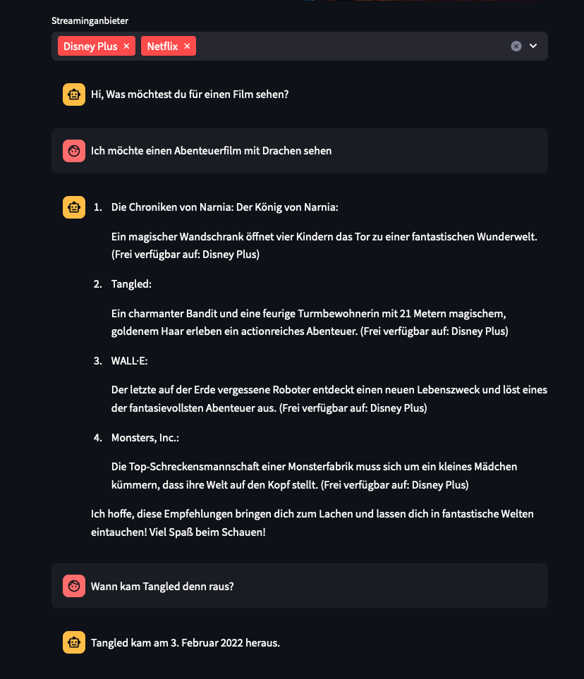
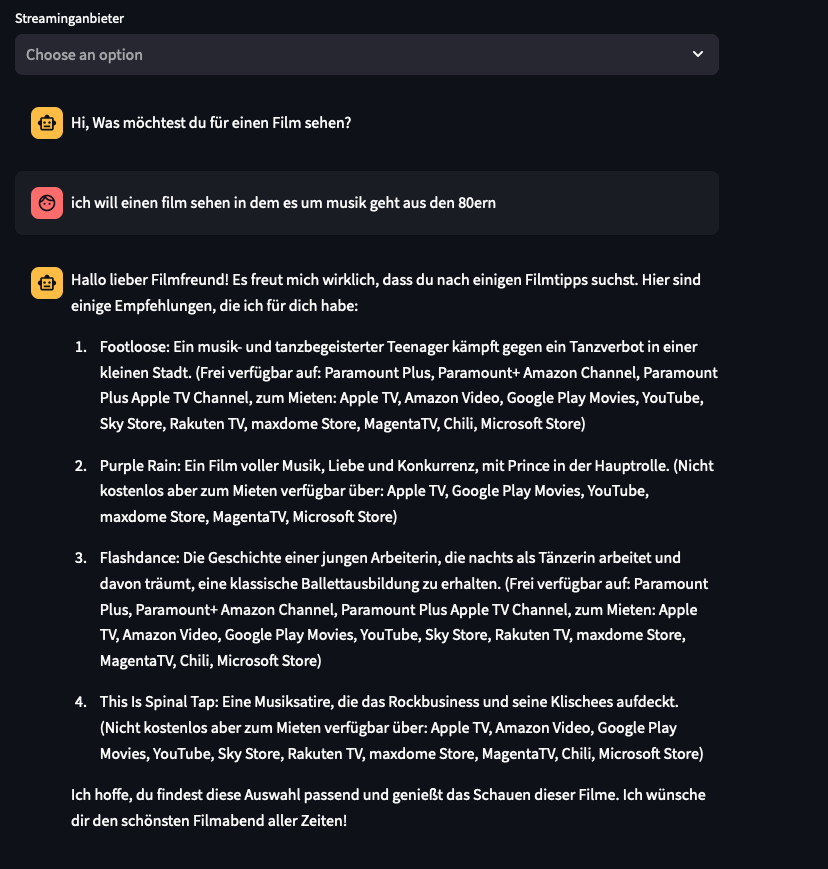

# Movie Bot prototyp

Should help find movies in a conversational way.
Output Movie Recommendation how to stream and answers questions about movies.

Currently useage of

OpenAI https://openai.com/
TMDB https://www.themoviedb.org/?language=de

examples:

## Steps

- [X] Get Movie Recommendations via LLM and userinput
- [X]  Use LLM function call to get the titles 
- [X]  search movies via TMDB Api and find streaming provider **AND AALL OTHER MOVIE_INFO DATA (PLAYTIME; ACTORS; GENRES)**
- [X]  write recommendation to chat output with context form 3

### Bonus Tasks
- [X] find newer once via tmdb api and recommendet titles
- [X] if user asks further questions answer based on api call
- [X] if user asks for new recros do this! - do not recro same movies in one session
- [X] build website with chat interface
- [ ] build website with images and direct links
- [ ] test with other cheaper llms
- [X] filter for providers
- [X] filter for other preferences like rent or free streaming
- [ ] use block/watch list
- [ ] Use mood as input and find the movie. 
( - [ ] inputfield for api key)

### Todos

- [X] script jupyter norebook for proof of concept
- [X] use env variables for api keys 
- [X] build streamit site
- [X] Use function calling for getting movie titles
- [ ] Multilingual

## Streamlit app
Run with `python -m streamlit run main.py`
### Env Variables

need to set the following variables

tmdb_bearer
openai_api_key

## Use with local ollama
curl https://ollama.ai/install.sh | sh
& ollama serve
ollama run llama2

          

